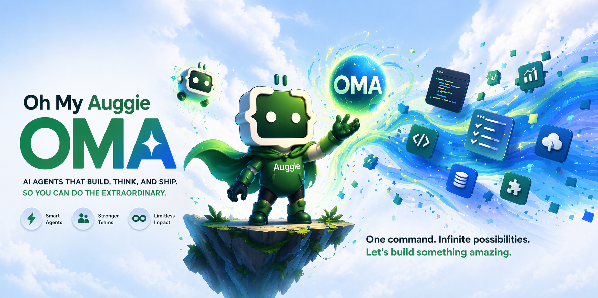
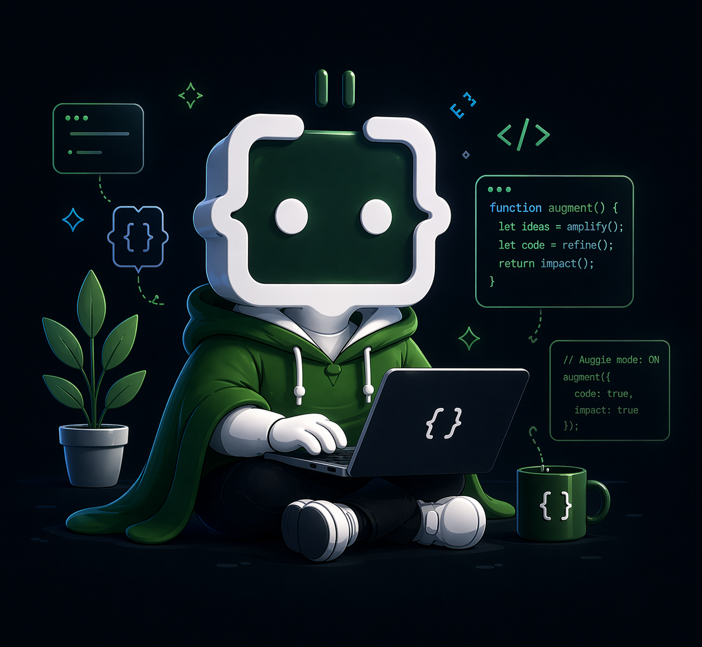

# oh-my-auggie

<!-- Banner -->
<p align="center">
  
</p>

<!-- Badges -->
<p align="center">

  [](https://github.com/sponsors/r3dlex)
  [](https://github.com/r3dlex/oh-my-auggie)
  [](https://www.augmentcode.com)
  [](LICENSE)

</p>

> **Orquestacion multi-agente para [CLI `auggie` de Augment Code](https://www.augmentcode.com)** — la experiencia "oh-my-*" para auggie.

---

## Instalacion

### Requisitos previos

- `auggie` >= 0.22.0 — [documentacion de instalacion](https://www.augmentcode.com)
- `node` >= 18 (para el servidor de estado MCP)

### Instalacion desde Marketplace (recomendado)

```bash
auggie plugin marketplace add r3dlex/oh-my-auggie
auggie plugin install oma@oh-my-auggie
```

Eso es todo. El plugin registra automaticamente todos los comandos, agentes, hooks y el servidor de estado MCP.

### Instalacion manual

```bash
git clone https://github.com/r3dlex/oh-my-auggie.git
cd oh-my-auggie
auggie plugin install --source ./plugins/oma oma@oh-my-auggie
```

<p align="center">
  
</p>

<p align="center">
  <em>OMA — installed and ready. What do you want to build?</em>
</p>

---

## Comandos

Una vez instalados, estos comandos slash estan disponibles:

| Comando | Descripcion |
|---------|-------------|
| `/oma:autopilot` | Pipeline autonomo completo — expandir, planificar, implementar, QA, validar |
| `/oma:ralph` | Bucle de persistencia — sigue trabajando hasta que todos los criterios de aceptacion pasen |
| `/oma:ultrawork` | Ejecucion paralela de alto rendimiento mediante subagentes concurrentes |
| `/oma:team` | Equipo coordinado de N agentes |
| `/oma:ultraqa` | Ciclos de QA: probar, verificar, corregir, repetir |
| `/oma:ralplan` | Planificacion por consenso con revision de Architect + Critic |
| `/oma:plan` | Planificacion estrategica con revision de analyst/architect |
| `/oma:cancel` | Cancelar modo activo y limpiar estado |
| `/oma:status` | Mostrar modo y estado actuales |
| `/oma:ask <model>` | Consultar con un modelo especifico |
| `/oma:note` | Escribir en el notepad (priority, working, manual) |
| `/oma:doctor` | Diagnosticar problemas de instalacion |

### Disparadores por palabra clave

Omite el prefijo `/oma:` — estos se activan automaticamente cuando se detectan en la conversacion:

| Palabra clave | Activa |
|---------|-----------|
| `autopilot` | `/oma:autopilot` |
| `ralph`, "don't stop" | `/oma:ralph` |
| `ulw`, `ultrawork` | `/oma:ultrawork` |
| `ralplan` | `/oma:ralplan` |
| `canceloma` | `/oma:cancel` |
| `deslop`, "anti-slop" | pasada de limpieza deslop |

<p align="center">
  
</p>

<p align="center">
  <em>OMA — parallel agents, persistent state, zero dependency overhead</em>
</p>

---

## Arquitectura

```
oh-my-auggie/
├── plugins/oma/
│   ├── agents/          # 4 subagentes (v0.1): explorer, planner, executor, architect
│   ├── commands/        # 5 comandos (v0.1): autopilot, ralph, status, cancel, help
│   ├── hooks/           # 3 hooks: session-start, delegation-enforce, stop-gate
│   ├── rules/           # orchestration.md, enterprise.md (aditivos)
│   └── mcp/
│       └── state-server.mjs   # Servidor de estado MCP sin dependencias
├── .augment-plugin/
│   └── marketplace.json  # Manifiesto del marketplace de Auggie
└── e2e/
    └── oma-core-loop.bats   # 34 pruebas de integracion
```

**Archivos de estado** (almacenados en `.oma/` — ignorados por git):

| Archivo | Proposito |
|------|---------|
| `.oma/state.json` | mode, active, iteration |
| `.oma/notepad.json` | secciones priority, working, manual |
| `.oma/task.log.json` | historial de veredictos de architect/executor |

---

## Perfiles

| Perfil | Descripcion |
|---------|-------------|
| **Community** (predeterminado) | Paralelizacion completa, sin puertas de aprobacion |
| **Enterprise** | Enrutamiento de modelos consciente de costos, requisitos de ADR, puertas de aprobacion |

Enterprise se activa creando `.oma/config.json` con `{ "profile": "enterprise" }`. Enterprise solo *agrega* reglas — nunca elimina las funcionalidades de la comunidad.

---

## Desarrollo

```bash
# Ejecutar el conjunto de pruebas
bats e2e/oma-core-loop.bats

# Lint de scripts de hooks
shellcheck plugins/oma/hooks/*.sh

# Validar todos los manifiestos
node -e "
  const fs = require('fs');
  const files = [
    '.augment-plugin/marketplace.json',
    'plugins/oma/.augment-plugin/plugin.json',
    'plugins/oma/.augment-plugin/.mcp.json',
    'plugins/oma/hooks/hooks.json',
    '.claude-plugin/plugin.json'
  ];
  for (const f of files) {
    try { JSON.parse(fs.readFileSync(f)); console.log('OK: ' + f); }
    catch(e) { console.error('FAIL: ' + f + ' - ' + e.message); process.exit(1); }
  }
"
```

---

## Seguridad

Consulta nuestra [Politica de Seguridad](SECURITY.md) para conocer las versiones compatibles y las directrices para reportar vulnerabilidades.

---

## Enlaces

| Recurso | URL |
|----------|-----|
| Augment Code | https://www.augmentcode.com |
| Documentacion de auggie CLI | https://www.augmentcode.com/docs/cli |
| Documentacion de plugins | https://www.augmentcode.com/docs/cli/plugins |
| Documentacion de hooks | https://www.augmentcode.com/docs/cli/hooks |
| Documentacion de MCP | https://www.augmentcode.com/docs/cli/integrations |
| oh-my-auggie | https://github.com/r3dlex/oh-my-auggie |

---

## Patrocinador

**:heart: ¿Te encanta oh-my-auggie? Considera patrocinar su desarrollo.**

Tu patrocinio financia directamente el tiempo y energia invertidos en hacer la orquestacion multi-agente accesible para cada desarrollador en la plataforma Augment Code. Cada contribucion — sin importar su tamano — ayuda a mantener el proyecto vivo, receptivo y en mejora continua.

👉 **[Patrocinar en GitHub](https://github.com/sponsors/r3dlex)**

Opciones unicas y recurrentes disponibles. Los patrocinadores son reconocidos en el README del proyecto y en las notas de lanzamiento.

---

*oh-my-auggie no esta afiliado con Augment Code. "auggie" y "Augment Code" son marcas registradas de sus respectivos duenos.*
