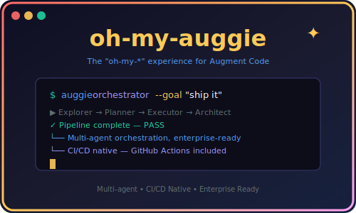

# oh-my-auggie

<p align="center">
  
</p>

> **The "oh-my-*" experience for [Augment Code's `auggie` CLI](https://www.augmentcode.com)** — multi-agent orchestration, opinionated conventions, and enterprise-grade CI/CD built right in.

---

## What is oh-my-auggie?

oh-my-auggie is a community-driven toolkit that wraps [Augment Code's `auggie` CLI](https://www.augmentcode.com) with the kind of polish, automation, and production-readiness you'd expect from mature open-source tooling. Think `oh-my-zsh` for your AI coding CLI.

Whether you're an individual developer who lives in the terminal or an enterprise team standardizing on AI-assisted development, oh-my-auggie helps you get more out of auggie — with less configuration.

## Features

- **Multi-Agent Orchestrator** — Explorer → Planner → Executor → Architect pipeline that autonomously drives complex tasks to completion
- **Shell-native** — Zero extra runtime dependencies; pure bash scripts that integrate seamlessly into any workflow
- **ADR Governance** — Architectural decisions tracked and enforced via [archgate](https://github.com/archgate/cli), because good teams document their choices
- **CI/CD Native** — GitHub Actions config included; bats tests and shellcheck run on every push
- **Enterprise Ready** — No hidden dependencies, predictable behavior, compliance-friendly documentation

## Quick Start

```bash
# Clone and run
git clone https://github.com/archgate/oh-my-auggie.git
cd oh-my-auggie

# Run the test suite
bats e2e/

# Invoke the orchestrator
./oh-my-auggie orchestrator --goal "add user authentication"
```

**Runtime dependency:** `auggie` (>= 0.22.0) — [install docs](https://www.augmentcode.com)

## The Orchestrator

oh-my-auggie's crown jewel: a 4-stage autonomous pipeline that chains four specialized agents:

```bash
./oh-my-auggie orchestrator --goal "add user authentication"
```

| Stage | Agent | Role |
|-------|-------|------|
| 1 | **Explorer** | Maps codebase structure and dependencies |
| 2 | **Planner** | Decomposes the goal into concrete, parallelizable tasks |
| 3 | **Executor** | Implements tasks (parallel where possible) |
| 4 | **Architect** | Verifies implementation and renders a verdict (PASS/FAIL/PARTIAL) |

**Key features:**
- Explicit barrier synchronization for parallel execution groups
- Defensive JSON parsing with `jq` and null-guarding fallback
- `OMA_DEBUG` env var for stderr visibility control (`0=silent, 1=show on error, 2=always show`)
- Full exit code semantics (`0=PASS, 1=FAIL, 2=PARTIAL, 10/11=auggie errors`)

See [`orchestrator.sh`](./orchestrator.sh) for the full pipeline.

## Architecture Decisions

We use [archgate](https://github.com/archgate/cli) to track and enforce architectural decisions. See the [adr/](./adr/) directory for current ADRs, and the [archgate ADR archive](https://github.com/archgate/cli/blob/main/adr/) for upstream decisions.

## Community

Contributions welcome! This is a community project — no corporation behind it, just developers helping developers.

### For Contributors

- Fork the repo and open PRs against `main`
- Run `bats e2e/` to execute the test suite
- Run `shellcheck orchestrator.sh oh-my-auggie priv/orchestrator/*.sh` to lint scripts
- See [SPEC.md](./SPEC.md) for full project architecture

### For Users

- Star the repo and watch it grow
- Open issues for bugs and feature requests
- Join discussions for questions and ideas

## Enterprise

oh-my-auggie is production-ready for enterprise use:

- **Predictable behavior**: Shell scripts with no hidden dependencies — what you see is what you execute
- **CI/CD native**: Works in any CI system; GitHub Actions config included with bats tests and shellcheck
- **Compliance-friendly**: ADRs tracked via [archgate](https://github.com/archgate/cli) so architectural decisions are documented and enforceable
- **Vendor-neutral**: Not affiliated with Augment Code — this is a community convenience layer

> **Want enterprise support, custom integrations, or dedicated features?** Open a discussion or reach out through the project's issue tracker.

## Links

| Resource | URL |
|----------|-----|
| Augment Code | https://www.augmentcode.com |
| auggie CLI | https://www.augmentcode.com/docs/cli |
| archgate CLI | https://github.com/archgate/cli |
| archgate ADR Archive | https://github.com/archgate/cli/blob/main/adr/ |
| oh-my-auggie | https://github.com/archgate/oh-my-auggie |

---

*oh-my-auggie is not affiliated with Augment Code. "auggie" and "Augment Code" are trademarks of their respective owners.*
